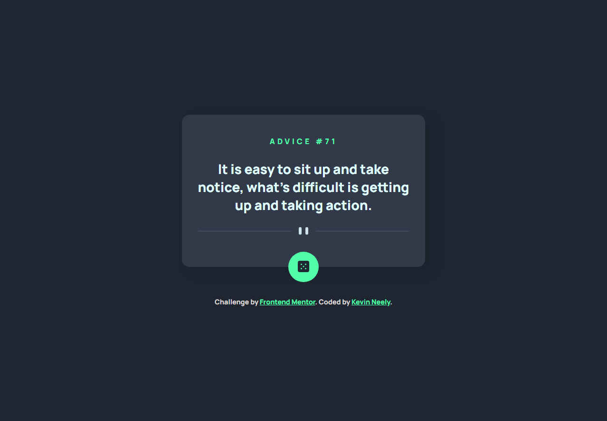

# Frontend Mentor - Advice generator app

## Welcome! 👋

Thanks for checking out this front-end coding challenge.

[Frontend Mentor](https://www.frontendmentor.io) challenges help you improve your coding skills by building realistic projects.

**To do this challenge, you need a basic understanding of HTML, CSS and JavaScript.**

## The challenge

Your challenge is to build out this advice generator app using the [Advice Slip API](https://api.adviceslip.com) and get it looking as close to the design as possible.

You can use any tools you like to help you complete the challenge. So if you've got something you'd like to practice, feel free to give it a go.

Your users should be able to:

- View the optimal layout for the app depending on their device's screen size
- See hover states for all interactive elements on the page
- Generate a new piece of advice by clicking the dice icon

### Screenshot

- Screen
  

### Links

- Solution URL: [Solution Site](https://www.frontendmentor.io/challenges/advice-generator-app-QdUG-13db/hub)
- Live Site URL: [Live Site](https://advice-generator-app-2dkn.netlify.app/)

### Built With

- SCSS
- Vanilla JS

## Author

-Frontend Mentor [@2dkn](https://www.frontendmentor.io/profile/2dkn)
